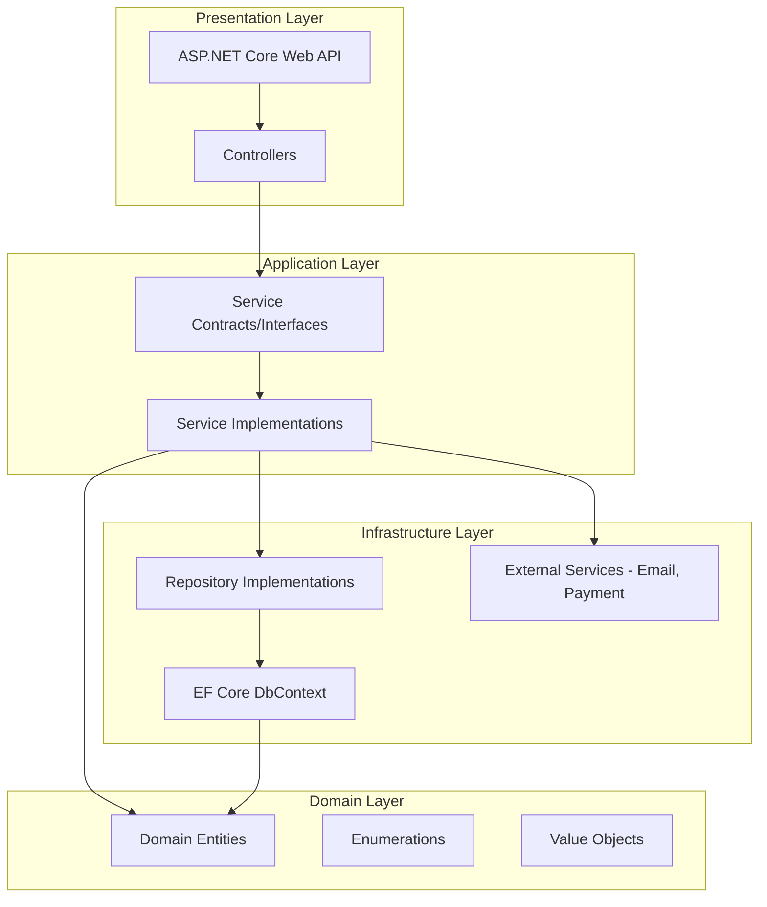

# Bazario E-Commerce Platform - Class Diagram

## Complete System Architecture

```mermaid
classDiagram
    %% ========================================
    %% DOMAIN LAYER - ENTITIES
    %% ========================================

    %% Authentication & User Management
    class User {
        +Guid UserId
        +string Email
        +string PasswordHash
        +string FirstName
        +string LastName
        +string PhoneNumber
        +DateTime CreatedAt
        +DateTime UpdatedAt
        +bool IsEmailVerified
        +string EmailVerificationToken
        +DateTime? EmailVerificationTokenExpiry
        +string PasswordResetToken
        +DateTime? PasswordResetTokenExpiry
    }

    class Role {
        +Guid RoleId
        +Guid UserId
        +string RoleName
        +DateTime AssignedAt
    }

    class RefreshToken {
        +Guid TokenId
        +Guid UserId
        +string Token
        +DateTime ExpiresAt
        +DateTime CreatedAt
        +bool IsRevoked
        +DateTime? RevokedAt
    }

    class Seller {
        +Guid SellerId
        +Guid UserId
        +string BusinessName
        +string TaxId
        +string BusinessAddress
        +DateTime CreatedAt
        +DateTime UpdatedAt
        +bool IsVerified
    }

    class Customer {
        +Guid CustomerId
        +Guid UserId
        +string ShippingAddress
        +string BillingAddress
        +DateTime CreatedAt
        +DateTime UpdatedAt
    }

    class Admin {
        +Guid AdminId
        +Guid UserId
        +string Department
        +DateTime CreatedAt
    }

    %% Store Management
    class Store {
        +Guid StoreId
        +Guid SellerId
        +string Name
        +string Description
        +string LogoUrl
        +string BannerUrl
        +bool IsActive
        +bool IsDeleted
        +DateTime CreatedAt
        +DateTime UpdatedAt
        +Guid CreatedBy
        +Guid? UpdatedBy
        +decimal FreeShippingThreshold
    }

    %% Catalog
    class Category {
        +Guid CategoryId
        +string Name
        +string Description
        +Guid? ParentCategoryId
        +int Level
        +bool IsActive
        +DateTime CreatedAt
        +DateTime UpdatedAt
    }

    class Product {
        +Guid ProductId
        +Guid StoreId
        +Guid CategoryId
        +string Name
        +string Description
        +decimal Price
        +string ImageUrl
        +string SKU
        +bool IsActive
        +bool IsDeleted
        +DateTime CreatedAt
        +DateTime UpdatedAt
        +Guid CreatedBy
        +Guid? UpdatedBy
        +decimal Weight
        +string Dimensions
    }

    class Discount {
        +Guid DiscountId
        +string Code
        +DiscountType Type
        +decimal Value
        +DateTime ValidFrom
        +DateTime ValidTo
        +decimal MinimumOrderAmount
        +Guid? ApplicableStoreId
        +string Description
        +bool IsActive
        +bool IsUsed
        +DateTime CreatedAt
        +DateTime UpdatedAt
        +Guid CreatedBy
        +Guid? UpdatedBy
    }

    %% Inventory
    class Inventory {
        +Guid InventoryId
        +Guid ProductId
        +int QuantityAvailable
        +int QuantityReserved
        +int ReorderLevel
        +int ReorderQuantity
        +DateTime? LastRestockedAt
        +DateTime CreatedAt
        +DateTime UpdatedAt
    }

    class InventoryMovement {
        +Guid MovementId
        +Guid InventoryId
        +MovementType MovementType
        +int Quantity
        +int QuantityBefore
        +int QuantityAfter
        +string Reason
        +Guid PerformedBy
        +DateTime CreatedAt
    }

    %% Order Management
    class Order {
        +Guid OrderId
        +Guid CustomerId
        +Guid StoreId
        +string OrderNumber
        +decimal SubtotalAmount
        +decimal DiscountAmount
        +decimal ShippingCost
        +decimal TotalAmount
        +OrderStatus Status
        +string ShippingAddress
        +string BillingAddress
        +string AppliedDiscountCodes
        +Guid ShippingGovernorateId
        +Guid ShippingCityId
        +DateTime Date
        +DateTime CreatedAt
        +DateTime UpdatedAt
        +Guid CreatedBy
        +Guid? UpdatedBy
    }

    class OrderItem {
        +Guid OrderItemId
        +Guid OrderId
        +Guid ProductId
        +int Quantity
        +decimal UnitPrice
        +decimal TotalPrice
        +decimal DiscountAmount
        +DateTime CreatedAt
    }

    %% Review System
    class Review {
        +Guid ReviewId
        +Guid ProductId
        +Guid StoreId
        +Guid CustomerId
        +int Rating
        +string Title
        +string Comment
        +bool IsVerified
        +bool IsDeleted
        +DateTime CreatedAt
        +DateTime UpdatedAt
        +Guid CreatedBy
        +Guid? UpdatedBy
    }

    %% Location Management
    class Country {
        +Guid CountryId
        +string Name
        +string Code
        +string PhoneCode
        +string Currency
        +bool IsActive
        +DateTime CreatedAt
    }

    class Governorate {
        +Guid GovernorateId
        +Guid CountryId
        +string Name
        +string Code
        +decimal BaseShippingCost
        +int EstimatedDeliveryDays
        +bool SupportsExpressDelivery
        +bool SupportsSameDayDelivery
        +bool IsActive
        +DateTime CreatedAt
    }

    class City {
        +Guid CityId
        +Guid GovernorateId
        +string Name
        +string PostalCode
        +decimal ShippingCostModifier
        +bool SupportsExpressDelivery
        +bool SupportsSameDayDelivery
        +bool IsActive
        +DateTime CreatedAt
    }

    class StoreGovernorateSupport {
        +Guid StoreId
        +Guid GovernorateId
        +decimal? CustomShippingCost
        +bool IsActive
        +DateTime CreatedAt
    }

    %% ========================================
    %% ENUMS
    %% ========================================

    class DiscountType {
        <<enumeration>>
        Percentage
        FixedAmount
    }

    class OrderStatus {
        <<enumeration>>
        Pending
        Processing
        Shipped
        Delivered
        Cancelled
    }

    class MovementType {
        <<enumeration>>
        Restock
        Sale
        Return
        Adjustment
    }

    %% ========================================
    %% SERVICE CONTRACTS - AUTHENTICATION
    %% ========================================

    class IAuthService {
        <<interface>>
        +RegisterAsync(request)
        +LoginAsync(request)
        +RefreshTokenAsync(refreshToken)
        +RevokeTokenAsync(token)
        +ForgotPasswordAsync(email)
        +ResetPasswordAsync(request)
    }

    class IUserRegistrationService {
        <<interface>>
        +RegisterUserAsync(request)
        +VerifyEmailAsync(token)
        +ResendVerificationEmailAsync(email)
    }

    class IUserAuthenticationService {
        <<interface>>
        +AuthenticateAsync(email, password)
        +ValidateCredentialsAsync(email, password)
    }

    class IUserManagementService {
        <<interface>>
        +GetUserByIdAsync(userId)
        +GetUserByEmailAsync(email)
        +UpdateUserAsync(userId, request)
        +DeleteUserAsync(userId)
    }

    class IJwtService {
        <<interface>>
        +GenerateAccessToken(user, roles)
        +GenerateRefreshToken()
        +ValidateToken(token)
        +GetUserIdFromToken(token)
    }

    class IRefreshTokenService {
        <<interface>>
        +CreateRefreshTokenAsync(userId)
        +ValidateRefreshTokenAsync(token)
        +RevokeRefreshTokenAsync(token)
        +RevokeAllUserTokensAsync(userId)
    }

    class IPasswordRecoveryService {
        <<interface>>
        +GeneratePasswordResetTokenAsync(email)
        +ValidatePasswordResetTokenAsync(token)
        +ResetPasswordAsync(token, newPassword)
    }

    %% ========================================
    %% SERVICE CONTRACTS - STORE
    %% ========================================

    class IStoreService {
        <<interface>>
        +Inherits: IStoreManagementService
        +Inherits: IStoreQueryService
        +Inherits: IStoreValidationService
        +Inherits: IStoreAnalyticsService
        +Inherits: IStoreShippingConfigurationService
    }

    class IStoreManagementService {
        <<interface>>
        +CreateStoreAsync(request)
        +UpdateStoreAsync(storeId, request)
        +DeleteStoreAsync(storeId)
        +ActivateStoreAsync(storeId)
        +DeactivateStoreAsync(storeId)
    }

    class IStoreQueryService {
        <<interface>>
        +GetStoreByIdAsync(storeId)
        +GetStoresBySellerIdAsync(sellerId)
        +GetAllStoresAsync(includeDeleted)
        +GetActiveStoresAsync()
        +SearchStoresAsync(searchTerm)
    }

    class IStoreValidationService {
        <<interface>>
        +ValidateStoreCreationAsync(request)
        +ValidateStoreUpdateAsync(storeId, request)
        +ValidateStoreSoftDeletionAsync(storeId)
        +ValidateStoreOwnershipAsync(storeId, userId)
    }

    class IStoreAnalyticsService {
        <<interface>>
        +GetStoreSalesAnalyticsAsync(storeId, dateRange)
        +GetStorePerformanceMetricsAsync(storeId)
        +GetTopSellingProductsAsync(storeId, count)
    }

    class IStoreShippingConfigurationService {
        <<interface>>
        +AddSupportedGovernorateAsync(storeId, governorateId)
        +RemoveSupportedGovernorateAsync(storeId, governorateId)
        +UpdateCustomShippingCostAsync(storeId, governorateId, cost)
        +GetSupportedGovernoratesAsync(storeId)
    }

    %% ========================================
    %% SERVICE CONTRACTS - PRODUCT
    %% ========================================

    class IProductService {
        <<interface>>
        +Inherits: IProductManagementService
        +Inherits: IProductQueryService
        +Inherits: IProductValidationService
        +Inherits: IProductAnalyticsService
        +Inherits: IProductInventoryService
    }

    class IProductManagementService {
        <<interface>>
        +CreateProductAsync(request)
        +UpdateProductAsync(productId, request)
        +DeleteProductAsync(productId)
        +ActivateProductAsync(productId)
        +DeactivateProductAsync(productId)
    }

    class IProductQueryService {
        <<interface>>
        +GetProductByIdAsync(productId)
        +GetProductsByStoreIdAsync(storeId)
        +GetProductsByCategoryIdAsync(categoryId)
        +SearchProductsAsync(searchTerm)
        +GetActiveProductsAsync()
    }

    class IProductValidationService {
        <<interface>>
        +ValidateProductCreationAsync(request)
        +ValidateProductUpdateAsync(productId, request)
        +ValidateProductDeletionAsync(productId)
        +ValidateSKUAsync(sku, excludeProductId)
    }

    class IProductAnalyticsService {
        <<interface>>
        +GetProductSalesAnalyticsAsync(productId)
        +GetProductPerformanceMetricsAsync(productId)
        +GetProductReviewSummaryAsync(productId)
    }

    class IProductInventoryService {
        <<interface>>
        +CheckStockAvailabilityAsync(productId, quantity)
        +ReserveStockAsync(productId, quantity)
        +ReleaseStockAsync(productId, quantity)
    }

    %% ========================================
    %% SERVICE CONTRACTS - INVENTORY
    %% ========================================

    class IInventoryService {
        <<interface>>
        +Inherits: IInventoryManagementService
        +Inherits: IInventoryQueryService
        +Inherits: IInventoryValidationService
        +Inherits: IInventoryAnalyticsService
        +Inherits: IInventoryAlertService
    }

    class IInventoryManagementService {
        <<interface>>
        +CreateInventoryAsync(productId, initialQuantity)
        +RestockInventoryAsync(inventoryId, quantity, performedBy)
        +AdjustInventoryAsync(inventoryId, quantity, reason, performedBy)
        +ReserveInventoryAsync(inventoryId, quantity)
        +ReleaseInventoryAsync(inventoryId, quantity)
    }

    class IInventoryQueryService {
        <<interface>>
        +GetInventoryByIdAsync(inventoryId)
        +GetInventoryByProductIdAsync(productId)
        +GetLowStockInventoriesAsync()
        +GetOutOfStockInventoriesAsync()
        +GetInventoryMovementsAsync(inventoryId)
    }

    class IInventoryValidationService {
        <<interface>>
        +ValidateStockAvailabilityAsync(inventoryId, quantity)
        +ValidateReorderLevelAsync(quantity)
    }

    class IInventoryAnalyticsService {
        <<interface>>
        +GetInventoryTurnoverRateAsync(inventoryId)
        +GetStockValueAsync(storeId)
        +GetMovementHistoryAsync(inventoryId, dateRange)
    }

    class IInventoryAlertService {
        <<interface>>
        +CheckLowStockAlertsAsync()
        +NotifyLowStockAsync(inventoryId)
        +CheckOutOfStockAlertsAsync()
    }

    %% ========================================
    %% SERVICE CONTRACTS - ORDER
    %% ========================================

    class IOrderService {
        <<interface>>
        +Inherits: IOrderManagementService
        +Inherits: IOrderQueryService
        +Inherits: IOrderValidationService
        +Inherits: IOrderAnalyticsService
        +Inherits: IOrderPaymentService
    }

    class IOrderManagementService {
        <<interface>>
        +CreateOrderAsync(request)
        +UpdateOrderStatusAsync(orderId, status)
        +CancelOrderAsync(orderId)
        +ProcessOrderAsync(orderId)
    }

    class IOrderQueryService {
        <<interface>>
        +GetOrderByIdAsync(orderId)
        +GetOrdersByCustomerIdAsync(customerId)
        +GetOrdersByStoreIdAsync(storeId)
        +GetOrdersByStatusAsync(status)
    }

    class IOrderValidationService {
        <<interface>>
        +ValidateOrderCreationAsync(request)
        +ValidateOrderCancellationAsync(orderId)
        +ValidateStatusTransitionAsync(orderId, newStatus)
    }

    class IOrderAnalyticsService {
        <<interface>>
        +GetOrderStatisticsAsync(dateRange)
        +GetRevenueAnalyticsAsync(dateRange)
        +GetTopCustomersAsync(count)
    }

    class IOrderPaymentService {
        <<interface>>
        +ProcessPaymentAsync(orderId, paymentDetails)
        +RefundPaymentAsync(orderId)
        +ValidatePaymentAsync(paymentDetails)
    }

    class IShippingZoneService {
        <<interface>>
        +CalculateShippingCostAsync(storeId, governorateId, cityId, weight)
        +ValidateShippingZoneAsync(storeId, governorateId)
        +GetAvailableShippingOptionsAsync(storeId, location)
    }

    %% ========================================
    %% SERVICE CONTRACTS - DISCOUNT
    %% ========================================

    class IDiscountService {
        <<interface>>
        +Inherits: IDiscountManagementService
        +Inherits: IDiscountValidationService
        +Inherits: IDiscountAnalyticsService
    }

    class IDiscountManagementService {
        <<interface>>
        +CreateDiscountAsync(request)
        +UpdateDiscountAsync(discountId, request)
        +DeleteDiscountAsync(discountId)
        +ActivateDiscountAsync(discountId)
        +DeactivateDiscountAsync(discountId)
    }

    class IDiscountValidationService {
        <<interface>>
        +ValidateDiscountCodeAsync(code, storeId)
        +ValidateDiscountApplicabilityAsync(discountId, orderId)
        +ValidateMinimumOrderAmountAsync(discountId, orderAmount)
    }

    class IDiscountAnalyticsService {
        <<interface>>
        +GetDiscountUsageStatisticsAsync(discountId)
        +GetDiscountPerformanceMetricsAsync(discountId)
        +GetTopPerformingDiscountsAsync(count)
    }

    %% ========================================
    %% SERVICE CONTRACTS - LOCATION
    %% ========================================

    class ICountryManagementService {
        <<interface>>
        +CreateCountryAsync(request)
        +UpdateCountryAsync(countryId, request)
        +GetAllCountriesAsync()
        +GetCountryByIdAsync(countryId)
    }

    class IGovernorateManagementService {
        <<interface>>
        +CreateGovernorateAsync(request)
        +UpdateGovernorateAsync(governorateId, request)
        +GetGovernoratesByCountryIdAsync(countryId)
        +GetGovernorateByIdAsync(governorateId)
    }

    class ICityManagementService {
        <<interface>>
        +CreateCityAsync(request)
        +UpdateCityAsync(cityId, request)
        +GetCitiesByGovernorateIdAsync(governorateId)
        +GetCityByIdAsync(cityId)
    }

    %% ========================================
    %% SERVICE CONTRACTS - REVIEW
    %% ========================================

    class IReviewService {
        <<interface>>
        +CreateReviewAsync(request)
        +UpdateReviewAsync(reviewId, request)
        +DeleteReviewAsync(reviewId)
        +GetReviewsByProductIdAsync(productId)
        +GetReviewsByStoreIdAsync(storeId)
        +GetReviewsByCustomerIdAsync(customerId)
    }

    %% ========================================
    %% SERVICE CONTRACTS - INFRASTRUCTURE
    %% ========================================

    class IEmailService {
        <<interface>>
        +SendEmailAsync(to, subject, body)
        +SendTemplatedEmailAsync(to, templateId, data)
    }

    class IEmailTemplateService {
        <<interface>>
        +GetWelcomeEmailTemplateAsync(userName)
        +GetPasswordResetEmailTemplateAsync(resetLink)
        +GetOrderConfirmationEmailTemplateAsync(order)
    }

    %% ========================================
    %% RELATIONSHIPS - ENTITIES
    %% ========================================

    User "1" -- "0..*" RefreshToken : has
    User "1" -- "0..*" Role : has
    User "1" -- "0..1" Seller : is
    User "1" -- "0..1" Customer : is
    User "1" -- "0..1" Admin : is

    Seller "1" -- "0..*" Store : owns
    Store "1" -- "0..*" Product : contains
    Store "1" -- "0..*" Order : receives
    Store "1" -- "0..*" Review : has
    Store "1" -- "0..*" StoreGovernorateSupport : supports

    Product "1" -- "0..*" OrderItem : ordered_in
    Product "1" -- "1" Inventory : has_stock
    Product "1" -- "0..*" Review : has_reviews
    Product "*" -- "1" Category : belongs_to
    Category "1" -- "0..*" Category : has_subcategories

    Customer "1" -- "0..*" Order : places
    Order "1" -- "0..*" OrderItem : contains
    Order "*" -- "0..1" Discount : applies
    Order "*" -- "1" City : ships_to_city
    Order "*" -- "1" Governorate : ships_to_governorate

    Discount "*" -- "0..1" Store : applicable_to

    Inventory "1" -- "0..*" InventoryMovement : has_movements

    Review "*" -- "1" Customer : written_by
    Review "*" -- "1" Product : for_product
    Review "*" -- "1" Store : for_store

    Country "1" -- "0..*" Governorate : contains
    Governorate "1" -- "0..*" City : contains
    Governorate "1" -- "0..*" StoreGovernorateSupport : supported_by
    Governorate "1" -- "0..*" Order : ships_to
    City "1" -- "0..*" Order : ships_to

    %% Enum Relationships
    Discount -- DiscountType : uses
    Order -- OrderStatus : has
    InventoryMovement -- MovementType : has

    %% ========================================
    %% RELATIONSHIPS - SERVICES (Simplified)
    %% ========================================

    IAuthService ..> IUserRegistrationService : delegates
    IAuthService ..> IUserAuthenticationService : delegates
    IAuthService ..> IJwtService : uses
    IAuthService ..> IRefreshTokenService : uses
    IAuthService ..> IPasswordRecoveryService : uses

    IStoreService ..> IStoreManagementService : composes
    IStoreService ..> IStoreQueryService : composes
    IStoreService ..> IStoreValidationService : composes
    IStoreService ..> IStoreAnalyticsService : composes
    IStoreService ..> IStoreShippingConfigurationService : composes

    IProductService ..> IProductManagementService : composes
    IProductService ..> IProductQueryService : composes
    IProductService ..> IProductValidationService : composes
    IProductService ..> IProductAnalyticsService : composes
    IProductService ..> IProductInventoryService : composes

    IInventoryService ..> IInventoryManagementService : composes
    IInventoryService ..> IInventoryQueryService : composes
    IInventoryService ..> IInventoryValidationService : composes
    IInventoryService ..> IInventoryAnalyticsService : composes
    IInventoryService ..> IInventoryAlertService : composes

    IOrderService ..> IOrderManagementService : composes
    IOrderService ..> IOrderQueryService : composes
    IOrderService ..> IOrderValidationService : composes
    IOrderService ..> IOrderAnalyticsService : composes
    IOrderService ..> IOrderPaymentService : composes

    IDiscountService ..> IDiscountManagementService : composes
    IDiscountService ..> IDiscountValidationService : composes
    IDiscountService ..> IDiscountAnalyticsService : composes

    IOrderService ..> IShippingZoneService : uses
    IOrderService ..> IDiscountService : uses
    IOrderService ..> IInventoryService : uses

    IProductService ..> IInventoryService : uses
    IStoreService ..> IStoreShippingConfigurationService : uses
```

---

## Architecture Overview

### Layer Organization



---

## Service Architecture Patterns

### 1. Composite Pattern
Main services (e.g., `IStoreService`, `IProductService`) compose multiple specialized services:
- **Management**: CRUD operations
- **Query**: Read-only operations
- **Validation**: Business rule validation
- **Analytics**: Reporting and statistics
- **Specialized**: Domain-specific operations

### 2. Single Responsibility Principle
Each service interface has a focused, single responsibility:
- `IStoreManagementService`: Store CRUD only
- `IStoreValidationService`: Validation logic only
- `IStoreAnalyticsService`: Analytics only

### 3. Dependency Inversion
- High-level modules (Services) depend on abstractions (Interfaces)
- Infrastructure (Repositories, External Services) implements abstractions
- Domain layer has zero dependencies on infrastructure

### 4. Interface Segregation
- Clients depend only on interfaces they use
- Small, focused interfaces prevent bloated dependencies
- Composite interfaces provide convenience when needed

---

## Key Design Decisions

### 1. Entity Relationships
- **One-to-One**: User ↔ Seller/Customer/Admin (via unique FK)
- **One-to-Many**: Store → Products, Order → OrderItems
- **Many-to-Many**: Store ↔ Governorate (via StoreGovernorateSupport)
- **Self-Referencing**: Category parent-child hierarchy

### 2. Soft Deletes
Entities with `IsDeleted` flag:
- Store
- Product
- Review

Maintains referential integrity and historical data.

### 3. Audit Trail
Most entities include:
- `CreatedAt`, `UpdatedAt`
- `CreatedBy`, `UpdatedBy`

Enables comprehensive audit logging.

### 4. Status Workflows
- **Order**: Pending → Processing → Shipped → Delivered (or Cancelled)
- **Discount**: Future → Active → Expired
- **Inventory**: In Stock → Low Stock → Out of Stock

### 5. Validation Strategy
Three-tier validation:
1. **DTO Validation**: Data annotations on request DTOs
2. **Service Validation**: Business rules in ValidationServices
3. **Repository Validation**: Database constraints

### 6. Query Optimization
- Separate Query services prevent N+1 queries
- Dedicated methods for common queries
- Analytics services use optimized read-only queries

---

## Service Dependencies

### Critical Dependencies
```
OrderService
  ├── IInventoryService (stock validation)
  ├── IDiscountService (price calculation)
  ├── IShippingZoneService (shipping cost)
  └── IProductService (product validation)

ProductService
  ├── IInventoryService (stock management)
  └── IStoreService (ownership validation)

StoreService
  ├── IStoreShippingConfigurationService (shipping zones)
  └── IGovernorateManagementService (location validation)
```

### Infrastructure Dependencies
```
All Services
  ├── Repository Interfaces (Data access)
  └── DbContext (EF Core - Infrastructure layer only)

Authentication Services
  ├── IEmailService (Verification emails)
  └── IJwtService (Token generation)

Order Services
  └── IOrderPaymentService (Payment processing - Paymob)
```

---

## Design Patterns Used

### 1. Repository Pattern
- Abstracts data access layer
- EF Core confined to Infrastructure
- Core layer depends only on repository interfaces

### 2. Composite Pattern
- Main services compose specialized services
- Example: `IStoreService` inherits from 5 specialized interfaces

### 3. Strategy Pattern
- Different discount types (Percentage, FixedAmount)
- Different movement types (Restock, Sale, Return, Adjustment)

### 4. Factory Pattern
- Service implementations create domain entities
- DTOs transformed to entities in services

### 5. Dependency Injection
- All dependencies injected via constructor
- Configured in `ConfigureServicesExtension`

---

## Scalability Considerations

### 1. Horizontal Scaling
- GUID primary keys prevent ID collision
- Stateless services enable load balancing
- Repository pattern allows caching layer insertion

### 2. Performance Optimization
- Separate Query services for read optimization
- Analytics services can use read replicas
- Inventory reservation prevents overselling

### 3. Future Enhancements
- CQRS ready (Query services separate from Command)
- Event sourcing compatible (audit fields + movement history)
- Microservices ready (bounded contexts via service groups)

---

## Testing Strategy

### Unit Tests
- Service layer: Mock repository interfaces
- Validation services: Test business rules
- Calculation logic: Test edge cases

### Integration Tests
- Repository implementations: Test against test database
- Service orchestration: Test service interactions
- End-to-end flows: Test complete workflows

### Test Coverage Targets
- Services: 90%+ coverage
- Repositories: 80%+ coverage
- Controllers: 70%+ coverage

---

*Last Updated: January 2025*
*Mermaid Version: Compatible with Mermaid 10.0+*
*Architecture Pattern: Clean Architecture / Onion Architecture*