# Bazario E-Commerce Platform - Entity Relationship Diagram

## Complete Database Schema

```mermaid
erDiagram
    %% Authentication & User Management
    User ||--o{ RefreshToken : "has"
    User ||--o{ Role : "has"
    User ||--o{ Seller : "can be"
    User ||--o{ Customer : "can be"
    User ||--o{ Admin : "can be"

    %% Store Management
    Seller ||--o{ Store : "owns"
    Store ||--o{ Product : "contains"
    Store ||--o{ Order : "receives"
    Store ||--o{ StoreGovernorateSupport : "supports"
    Store ||--o{ Review : "has"
    Store ||--o| InventoryAlertPreferences : "has alert config"
    Store ||--o| StoreShippingConfiguration : "has shipping config"

    %% Product & Catalog
    Product ||--o{ OrderItem : "ordered in"
    Product ||--o{ Inventory : "has stock"
    Product ||--o{ Review : "has"
    Product }o--|| Category : "belongs to"
    Category ||--o{ Category : "has subcategory"

    %% Order Management
    Customer ||--o{ Order : "places"
    Order ||--o{ OrderItem : "contains"
    Order }o--o| Discount : "applies"
    Order }o--|| City : "ships to"
    Order }o--|| Governorate : "ships to"

    %% Discount System
    Discount }o--o| Store : "applicable to"

    %% Inventory Management
    Inventory ||--o{ InventoryMovement : "has movements"

    %% Review System
    Review }o--|| Customer : "written by"
    Review }o--|| Product : "for"
    Review }o--|| Store : "for"

    %% Location Management
    Country ||--o{ Governorate : "contains"
    Governorate ||--o{ City : "contains"
    Governorate ||--o{ StoreGovernorateSupport : "supported by stores"
    Governorate ||--o{ Order : "ships to"
    City ||--o{ Order : "ships to"

    %% User Entity
    User {
        guid UserId PK
        string Email "UNIQUE"
        string PasswordHash
        string FirstName
        string LastName
        string PhoneNumber
        datetime CreatedAt
        datetime UpdatedAt
        bool IsEmailVerified
        string EmailVerificationToken
        datetime EmailVerificationTokenExpiry
        string PasswordResetToken
        datetime PasswordResetTokenExpiry
    }

    %% Role Entity
    Role {
        guid RoleId PK
        guid UserId FK
        string RoleName "Admin-Seller-Customer"
        datetime AssignedAt
    }

    %% Refresh Token Entity
    RefreshToken {
        guid TokenId PK
        guid UserId FK
        string Token "UNIQUE"
        datetime ExpiresAt
        datetime CreatedAt
        bool IsRevoked
        datetime RevokedAt
    }

    %% Seller Entity
    Seller {
        guid SellerId PK
        guid UserId "FK-UNIQUE"
        string BusinessName
        string TaxId
        string BusinessAddress
        datetime CreatedAt
        datetime UpdatedAt
        bool IsVerified
    }

    %% Customer Entity
    Customer {
        guid CustomerId PK
        guid UserId "FK-UNIQUE"
        string ShippingAddress
        string BillingAddress
        datetime CreatedAt
        datetime UpdatedAt
    }

    %% Admin Entity
    Admin {
        guid AdminId PK
        guid UserId "FK-UNIQUE"
        string Department
        datetime CreatedAt
    }

    %% Store Entity
    Store {
        guid StoreId PK
        guid SellerId FK
        string Name "UNIQUE"
        string Description
        string LogoUrl
        string BannerUrl
        bool IsActive
        bool IsDeleted
        datetime CreatedAt
        datetime UpdatedAt
        guid CreatedBy FK
        guid UpdatedBy FK
        decimal FreeShippingThreshold
    }

    %% Category Entity
    Category {
        guid CategoryId PK
        string Name
        string Description
        guid ParentCategoryId "FK-nullable"
        int Level
        bool IsActive
        datetime CreatedAt
        datetime UpdatedAt
    }

    %% Product Entity
    Product {
        guid ProductId PK
        guid StoreId FK
        guid CategoryId FK
        string Name
        string Description
        decimal Price
        string ImageUrl
        string SKU "UNIQUE"
        bool IsActive
        bool IsDeleted
        datetime CreatedAt
        datetime UpdatedAt
        guid CreatedBy FK
        guid UpdatedBy FK
        decimal Weight
        string Dimensions
    }

    %% Inventory Entity
    Inventory {
        guid InventoryId PK
        guid ProductId "FK-UNIQUE"
        int QuantityAvailable
        int QuantityReserved
        int ReorderLevel
        int ReorderQuantity
        datetime LastRestockedAt
        datetime CreatedAt
        datetime UpdatedAt
    }

    %% Inventory Movement Entity
    InventoryMovement {
        guid MovementId PK
        guid InventoryId FK
        string MovementType "Restock-Sale-Return-Adjustment"
        int Quantity
        int QuantityBefore
        int QuantityAfter
        string Reason
        guid PerformedBy FK
        datetime CreatedAt
    }

    %% Inventory Alert Preferences Entity
    InventoryAlertPreferences {
        guid StoreId "PK, FK"
        string AlertEmail
        bool EnableLowStockAlerts
        bool EnableOutOfStockAlerts
        bool EnableRestockRecommendations
        bool EnableDeadStockAlerts
        int DefaultLowStockThreshold
        int DeadStockDays
        bool SendDailySummary
        bool SendWeeklySummary
        datetime CreatedAt
        datetime UpdatedAt
    }

    %% Order Entity
    Order {
        guid OrderId PK
        guid CustomerId FK
        guid StoreId FK
        string OrderNumber "UNIQUE"
        decimal SubtotalAmount
        decimal DiscountAmount
        decimal ShippingCost
        decimal TotalAmount
        string Status "Pending-Processing-Shipped-Delivered-Cancelled"
        string ShippingAddress
        string BillingAddress
        string AppliedDiscountCodes
        guid ShippingGovernorateId FK
        guid ShippingCityId FK
        datetime Date
        datetime CreatedAt
        datetime UpdatedAt
        guid CreatedBy FK
        guid UpdatedBy FK
    }

    %% Order Item Entity
    OrderItem {
        guid OrderItemId PK
        guid OrderId FK
        guid ProductId FK
        int Quantity
        decimal UnitPrice
        decimal TotalPrice
        decimal DiscountAmount
        datetime CreatedAt
    }

    %% Discount Entity
    Discount {
        guid DiscountId PK
        string Code "UNIQUE"
        string Type "Percentage-FixedAmount"
        decimal Value
        datetime ValidFrom
        datetime ValidTo
        decimal MinimumOrderAmount
        guid ApplicableStoreId "FK-nullable"
        string Description
        bool IsActive
        bool IsUsed
        datetime CreatedAt
        datetime UpdatedAt
        guid CreatedBy FK
        guid UpdatedBy FK
    }

    %% Review Entity
    Review {
        guid ReviewId PK
        guid ProductId FK
        guid StoreId FK
        guid CustomerId FK
        int Rating "1-to-5"
        string Title
        string Comment
        bool IsVerified
        bool IsDeleted
        datetime CreatedAt
        datetime UpdatedAt
        guid CreatedBy FK
        guid UpdatedBy FK
    }

    %% Country Entity
    Country {
        guid CountryId PK
        string Name "UNIQUE"
        string Code "UNIQUE-ISO3166"
        string PhoneCode
        string Currency
        bool IsActive
        datetime CreatedAt
    }

    %% Governorate Entity
    Governorate {
        guid GovernorateId PK
        guid CountryId FK
        string Name
        string Code "UNIQUE"
        decimal BaseShippingCost
        int EstimatedDeliveryDays
        bool SupportsExpressDelivery
        bool SupportsSameDayDelivery
        bool IsActive
        datetime CreatedAt
    }

    %% City Entity
    City {
        guid CityId PK
        guid GovernorateId FK
        string Name
        string PostalCode "nullable"
        decimal ShippingCostModifier
        bool SupportsExpressDelivery
        bool SupportsSameDayDelivery
        bool IsActive
        datetime CreatedAt
    }

    %% Store Governorate Support (Many-to-Many)
    StoreGovernorateSupport {
        guid StoreId "PK-FK"
        guid GovernorateId "PK-FK"
        decimal CustomShippingCost "nullable"
        bool IsActive
        datetime CreatedAt
    }

    %% Store Shipping Configuration Entity
    StoreShippingConfiguration {
        guid StoreId "PK-FK"
        bool EnableStandardDelivery
        decimal StandardDeliveryFee
        bool EnableSameDayDelivery
        decimal SameDayDeliveryFee
        int SameDayDeliveryCutoffHour
        bool EnableExpressDelivery
        decimal ExpressDeliveryFee
        decimal FreeShippingThreshold
        bool IsActive
        datetime CreatedAt
        datetime UpdatedAt
        guid CreatedBy "FK"
        guid UpdatedBy "FK-nullable"
    }
```



---

## Relationship Summary

### One-to-Many Relationships
- **User → RefreshToken** (1:N) - User can have multiple refresh tokens
- **User → Role** (1:N) - User can have multiple roles
- **Seller → Store** (1:N) - Seller can own multiple stores
- **Store → Product** (1:N) - Store contains multiple products
- **Store → Review** (1:N) - Store has multiple reviews
- **Product → OrderItem** (1:N) - Product can be in multiple order items
- **Product → Review** (1:N) - Product has multiple reviews
- **Customer → Order** (1:N) - Customer can place multiple orders
- **Order → OrderItem** (1:N) - Order contains multiple items
- **Category → Category** (1:N) - Parent-child category hierarchy
- **Country → Governorate** (1:N) - Country has multiple governorates
- **Governorate → City** (1:N) - Governorate has multiple cities
- **Inventory → InventoryMovement** (1:N) - Inventory has movement history

### One-to-One Relationships
- **Store → InventoryAlertPreferences** (1:0..1) - Store can have alert preferences configuration
- **Store → StoreShippingConfiguration** (1:0..1) - Store can have shipping configuration

### Many-to-One Relationships
- **Store → Seller** (N:1) - Multiple stores belong to one seller
- **Product → Category** (N:1) - Multiple products in one category
- **Order → Customer** (N:1) - Multiple orders from one customer
- **Order → Store** (N:1) - Multiple orders to one store
- **Order → Governorate** (N:1) - Multiple orders to one governorate
- **Order → City** (N:1) - Multiple orders to one city
- **Review → Customer** (N:1) - Multiple reviews by one customer
- **Review → Product** (N:1) - Multiple reviews for one product
- **Review → Store** (N:1) - Multiple reviews for one store

### Many-to-Many Relationships
- **Store ↔ Governorate** (N:M) - Via StoreGovernorateSupport junction table

### Optional Relationships
- **Discount → Store** (N:0..1) - Discount can be store-specific or global
- **Category → Category** (N:0..1) - Category can have parent category

---

## Key Constraints & Indexes

### Unique Constraints
- **User:** Email
- **Store:** Name (platform-wide uniqueness)
- **Product:** SKU
- **Discount:** Code
- **Order:** OrderNumber
- **Country:** Name, Code
- **Governorate:** Code (within country)
- **RefreshToken:** Token
- **Seller:** UserId (1:1 relationship)
- **Customer:** UserId (1:1 relationship)
- **Admin:** UserId (1:1 relationship)
- **Inventory:** ProductId (1:1 relationship)
- **InventoryAlertPreferences:** StoreId (1:0..1 relationship with Store)
- **StoreShippingConfiguration:** StoreId (1:0..1 relationship with Store)

### Foreign Keys
- All relationships enforce referential integrity
- Soft deletes used for Store, Product, Review (IsDeleted flag)
- Cascading deletes configured for dependent entities

### Recommended Indexes
```sql
-- User indexes
CREATE INDEX IX_User_Email ON User(Email);

-- Store indexes
CREATE INDEX IX_Store_SellerId ON Store(SellerId);
CREATE INDEX IX_Store_Name ON Store(Name);
CREATE INDEX IX_Store_IsActive_IsDeleted ON Store(IsActive, IsDeleted);

-- Product indexes
CREATE INDEX IX_Product_StoreId ON Product(StoreId);
CREATE INDEX IX_Product_CategoryId ON Product(CategoryId);
CREATE INDEX IX_Product_SKU ON Product(SKU);
CREATE INDEX IX_Product_IsActive_IsDeleted ON Product(IsActive, IsDeleted);

-- Order indexes
CREATE INDEX IX_Order_CustomerId ON Order(CustomerId);
CREATE INDEX IX_Order_StoreId ON Order(StoreId);
CREATE INDEX IX_Order_Status ON Order(Status);
CREATE INDEX IX_Order_Date ON Order(Date);
CREATE INDEX IX_Order_ShippingGovernorateId ON Order(ShippingGovernorateId);

-- OrderItem indexes
CREATE INDEX IX_OrderItem_OrderId ON OrderItem(OrderId);
CREATE INDEX IX_OrderItem_ProductId ON OrderItem(ProductId);

-- Discount indexes
CREATE INDEX IX_Discount_Code ON Discount(Code);
CREATE INDEX IX_Discount_ValidFrom_ValidTo ON Discount(ValidFrom, ValidTo);
CREATE INDEX IX_Discount_IsActive ON Discount(IsActive);

-- Review indexes
CREATE INDEX IX_Review_ProductId ON Review(ProductId);
CREATE INDEX IX_Review_StoreId ON Review(StoreId);
CREATE INDEX IX_Review_CustomerId ON Review(CustomerId);
CREATE INDEX IX_Review_IsDeleted ON Review(IsDeleted);

-- Inventory indexes
CREATE INDEX IX_Inventory_ProductId ON Inventory(ProductId);

-- InventoryAlertPreferences indexes
CREATE INDEX IX_InventoryAlertPreferences_StoreId ON InventoryAlertPreferences(StoreId);
CREATE INDEX IX_InventoryAlertPreferences_AlertEmail ON InventoryAlertPreferences(AlertEmail);
CREATE INDEX IX_InventoryAlertPreferences_CreatedAt ON InventoryAlertPreferences(CreatedAt);
CREATE INDEX IX_InventoryAlertPreferences_UpdatedAt ON InventoryAlertPreferences(UpdatedAt);

-- Location indexes
CREATE INDEX IX_Governorate_CountryId ON Governorate(CountryId);
CREATE INDEX IX_City_GovernorateId ON City(GovernorateId);

-- StoreShippingConfiguration indexes
CREATE INDEX IX_StoreShippingConfiguration_StoreId ON StoreShippingConfiguration(StoreId);
CREATE INDEX IX_StoreShippingConfiguration_IsActive ON StoreShippingConfiguration(IsActive);
```

---

## Business Rules Enforced

1. **User Management**
   - Email must be unique and verified
   - Password stored as hash only
   - Users can have multiple roles (Admin, Seller, Customer)
   - One user can be Seller AND Customer simultaneously

2. **Store Management**
   - Store name must be unique across platform
   - Only verified sellers can create stores
   - Sellers can own multiple stores (configurable limit: 10)
   - Soft delete to maintain historical data

3. **Product Management**
   - SKU must be unique across platform
   - Products belong to exactly one store and category
   - Soft delete preserves order history
   - Each product has exactly one inventory record

4. **Order Processing**
   - Order number auto-generated and unique
   - Status transitions: Pending → Processing → Shipped → Delivered
   - Cannot modify shipped/delivered orders
   - Can only cancel Pending/Processing orders
   - Order belongs to one customer and one store

5. **Discount System**
   - Discount codes are unique
   - Can be store-specific or global (nullable ApplicableStoreId)
   - Date-based validity (ValidFrom, ValidTo)
   - Minimum order amount supported
   - Multiple discounts can be applied per order

6. **Inventory Management**
   - Quantity = QuantityAvailable + QuantityReserved
   - All movements tracked with before/after quantities
   - Low stock alerts based on ReorderLevel
   - One-to-one relationship with Product

7. **Inventory Alert Management**
   - Alert preferences are per-store configuration
   - Uses 3-layer cache-aside pattern: Memory Cache → Database → Config Defaults
   - All alert methods return Task<bool> to indicate success/failure
   - Preferences persist across application restarts
   - Cache invalidation on updates prevents stale data
   - Thread-safe with per-store locking to prevent cache stampede
   - Email notifications for low stock, out-of-stock, and restock recommendations
   - Supports bulk alert processing and daily/weekly summaries
   - Configurable thresholds per store

8. **Location-Based Shipping**
   - Hierarchical: Country → Governorate → City
   - Store can support specific governorates (custom rates)
   - Shipping cost = Governorate base + City modifier
   - Express/Same-day delivery support flags

9. **Store Shipping Configuration**
   - One-to-one relationship with Store
   - Configurable delivery types (Standard, Same-Day, Express)
   - Per-store fee customization
   - Same-day delivery cutoff hour (orders after cutoff get standard delivery)
   - Free shipping threshold support
   - Active/inactive configuration status
   - Audit trail with CreatedBy/UpdatedBy

10. **Review System**
   - Customer can review products and stores
   - Rating scale 1-5
   - Verified purchases flagged
   - Soft delete to maintain integrity

---

## Data Volume Estimates

| Entity | Expected Volume | Growth Rate | Primary Indexes |
|--------|----------------|-------------|-----------------|
| User | 100K - 1M | Medium | Email |
| Store | 5K - 50K | Medium | SellerId, Name |
| Product | 100K - 1M | High | StoreId, CategoryId, SKU |
| Order | 500K - 5M | High | CustomerId, StoreId, Date, Status |
| OrderItem | 1M - 10M | High | OrderId, ProductId |
| Inventory | 100K - 1M | Medium | ProductId |
| InventoryMovement | 1M - 10M | High | InventoryId, CreatedAt |
| Review | 100K - 1M | Medium | ProductId, StoreId, CustomerId |
| Discount | 1K - 10K | Low | Code, ValidFrom, ValidTo |
| Country | <200 | Static | Name, Code |
| Governorate | <500 | Static | CountryId, Code |
| City | <5K | Static | GovernorateId |

---

## Design Notes

### Architecture Decisions

1. **GUID vs INT Primary Keys**
   - GUIDs used for distributed system scalability
   - Prevents ID collision in multi-tenant scenarios
   - Better for public-facing APIs (obscurity)

2. **Soft Deletes**
   - Store, Product, Review use IsDeleted flag
   - Maintains referential integrity
   - Preserves historical data for analytics
   - Allows "undelete" functionality

3. **Audit Fields**
   - CreatedAt, UpdatedAt for all entities
   - CreatedBy, UpdatedBy for entities with user actions
   - Enables comprehensive audit trails

4. **Denormalization**
   - AppliedDiscountCodes stored as string in Order
   - Reason: Performance (avoid joins), Historical accuracy
   - Trade-off: Storage vs. Query performance

5. **Computed Fields**
   - TotalPrice in OrderItem = Quantity × UnitPrice - DiscountAmount
   - Stored for performance and historical accuracy
   - Prevents recalculation issues after price changes

6. **Temporal Data**
   - ValidFrom/ValidTo in Discount for campaign scheduling
   - Enables future-dated and expiring promotions
   - Automatic activation/deactivation logic

7. **Junction Tables**
   - StoreGovernorateSupport enables many-to-many
   - Allows custom shipping rates per store-governorate pair
   - Supports gradual store expansion by region

8. **Hierarchical Data**
   - Category self-reference for nested categories
   - Country → Governorate → City for location
   - Enables flexible organizational structures

---

## Entity Lifecycle States

### Store States
```
Created → Active → [Inactive] → Deleted (soft)
```

### Product States
```
Created → Active → [Inactive] → Deleted (soft)
```

### Order States
```
Pending → Processing → Shipped → Delivered
           ↓
        Cancelled
```

### Inventory States
```
In Stock (QuantityAvailable > 0)
Low Stock (QuantityAvailable <= ReorderLevel)
Out of Stock (QuantityAvailable = 0)
Reserved (QuantityReserved > 0)
```

### Discount States
```
Future (Now < ValidFrom)
Active (ValidFrom <= Now <= ValidTo)
Expired (Now > ValidTo)
Used (IsUsed = true, for one-time codes)
```

---

*Last Updated: January 2025*
*Mermaid Version: Compatible with Mermaid 9.0+*